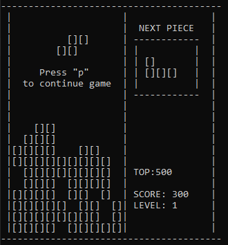
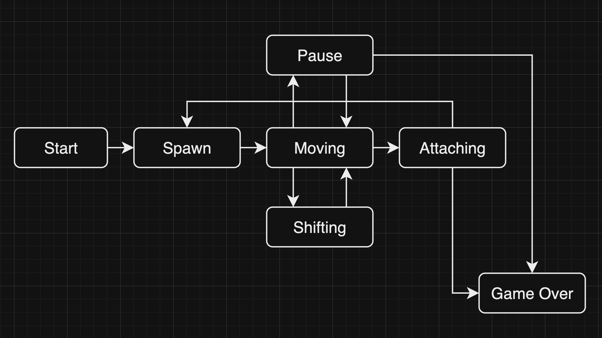

# BrickGame Tetris

_Developed by @convictw_

### Requrements for installing:
* gcc
* make
* ncurses library

### Installing:
* make install

### Controls
  - "Enter" - Start game,
  - "p" - Pause,
  - "q" - End game,
  - Left arrow - movement of the piece to the left,
  - Right arrow - movement of the piece to the right,
  - Down arrow - accelerates the piece,
  - Up arrow - piece rotation,
  - "Space bar" - piece falls.

### Scoring
* 1 row: 100 points
* 2 rows: 300 points
* 3 rows: 700 points
* 4 rows: 1500 points

Each time a player gains 600 points, the level increases by 1. Increasing the level boosts the speed at which the pieces move. The maximum number of levels is 10.

The logic of this game is represented by this variant of the finite state machine:

Enjoy the game!